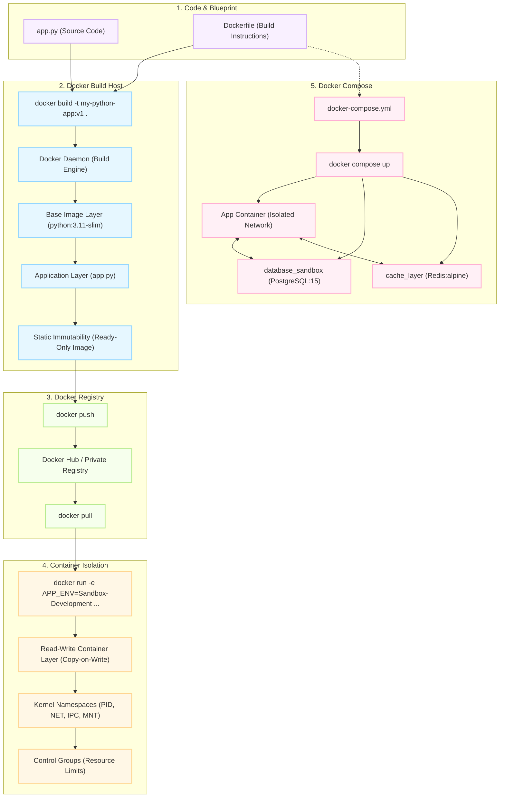

# 🐳 The Docker Ecosystem: In-Depth Architectural & Workflow Deep Dive

This comprehensive guide expands upon the workflow conceptualized in the updated [sample.excalidraw](file:///d:/kabish_localmodel_exercise/samples/sample.excalidraw) diagram. It breaks down the mechanics of the `Dockerfile`, explains intermediate layers, details container isolation, and analyzes multi-container orchestration via Docker Compose.

---

## 🗺️ The Complete Container Lifecycle & Workflow

The diagram below visualizes the entire lifecycle of a containerized application—from local source code down to multi-container orchestration.



---

## 🔍 In-Depth `Dockerfile` Breakdown

A `Dockerfile` is a text document containing all the commands a user could call on the command line to assemble an image. Here is the step-by-step architectural breakdown of your [Dockerfile](file:///d:/kabish_localmodel_exercise/samples/Dockerfile):

```dockerfile
# Step 1: Start from an official, optimized lightweight Python base layer
FROM python:3.11-slim
```

### 1. `FROM python:3.11-slim`
* **The Base Image:** Every `Dockerfile` must begin with a `FROM` instruction. This initializes a new build stage and sets the Base Image for subsequent instructions.
* **Why `slim`?**
  * **Default/Full (`python:3.11`):** Built on top of full Debian releases. Includes massive build tools, headers, and utilities. Size is usually **~1GB**.
  * **Slim (`python:3.11-slim`):** Includes only the minimal packages required to run Python. It strips away compilers, documentation, and non-essential system tools. Size is usually **~120MB**. Excellent balance of security, size, and compatibility.
  * **Alpine (`python:3.11-alpine`):** Built on Alpine Linux (uses `musl libc` instead of `glibc`). Extremely small (**~45MB**), but can cause compilation issues for binary Python wheels (like `numpy`, `pandas`, or `cryptography`) because `musl` behaves differently.
* **Security Layering:** By using `slim`, you drastically reduce the **attack surface** of your container (fewer installed packages mean fewer potential vulnerabilities).

---

```dockerfile
# Step 2: Set the working directory inside the virtual filesystem of the container
WORKDIR /app
```

### 2. `WORKDIR /app`
* **Directory Creation & Context:** This command sets the working directory for any subsequent `RUN`, `CMD`, `ENTRYPOINT`, `COPY`, and `ADD` instructions.
* **Key Mechanics:**
  * If the directory does not exist, Docker **automatically creates it** in the container's virtual filesystem.
  * Absolute paths are preferred to avoid relative path confusion.
  * It isolates your application code from standard operating system directories (`/etc`, `/bin`, `/var`), ensuring that execution context is predictable.

---

```dockerfile
# Step 3: Copy our local app.py script into the container's working directory
COPY app.py .
```

### 3. `COPY app.py .`
* **Build Context Bridge:**
  * When you run `docker build .`, the last argument `.` defines the **Build Context**. All files in that directory are compressed and sent to the Docker Daemon.
  * `COPY` takes a file from the host filesystem (within the build context) and writes it into the container's virtual filesystem.
  * The second parameter `.` refers to the current `WORKDIR` (which is `/app`).
* **The Layer Caching Principle:**
  * Docker builds images in **layers**. Each step in the `Dockerfile` represents a read-only layer.
  * If a layer's input has not changed, Docker reuses the cached layer instead of rebuilding it.
  * > [!TIP]
    > **Best Practice Optimization:** In complex applications, copy package definitions (e.g. `requirements.txt`) and run dependencies installations (`pip install`) *before* copying application code. Because source code changes frequently but package dependencies do not, this prevents slow package re-installations on every single build!

---

```dockerfile
# Step 4: Define the command that executes automatically when the container boots up
CMD ["python", "app.py"]
```

### 4. `CMD ["python", "app.py"]`
* **Container Entrypoint vs Command:** `CMD` defines the default executable and arguments that run when the container starts.
* **Executable Form (Preferred):**
  * `CMD ["python", "app.py"]` is written in **JSON Array (exec) form**. This runs the command directly without invoking a system shell.
  * This is critical because `python` is executed as **PID 1** (Process ID 1) inside the container. PID 1 is responsible for receiving OS signals like `SIGINT` (Ctrl+C) and `SIGTERM` (Docker Stop).
* **Shell Form (Discouraged):**
  * If written as `CMD python app.py`, Docker wraps it in a shell: `/bin/sh -c "python app.py"`.
  * The shell process becomes PID 1, and it does not forward system signals to Python. This results in standard stops (`docker stop`) hanging for 10 seconds before being forcefully killed (`SIGKILL`).

---

## ⚡ The Lifecycle Phases

### 🛠️ Phase 1: Build-Time (Static Blueprint)
When you run `docker build -t my-python-app:v1 .`:
1. **Context Loading:** The CLI packages files in your folder and uploads them to the Docker Engine.
2. **Base Retrieval:** If `python:3.11-slim` is not present locally, Docker pulls it layer-by-layer from Docker Hub.
3. **Execution Steps:** Docker boots up a temporary container for each step, commits the changes to a new read-only image layer, and destroys the temporary container.
4. **UnionFS Compilation:** All the read-only layers are stacked vertically. They are unified under a single filesystem tree called the **Union File System (UnionFS)**.

---

### 🚀 Phase 2: Runtime Isolation (Dynamic Sandbox)
When you run `docker run -e APP_ENV=Sandbox-Development my-python-app:v1`:
Docker requests the Linux kernel to instantiate a container using three principal OS-level virtualization primitives:

1. **Kernel Namespaces (Strict Isolation):**
   * **PID Namespace:** The container only sees processes running within itself. Your `app.py` thinks it is the only process running on the machine.
   * **NET Namespace:** The container gets its own virtual loopback device and private IP address within a bridge network.
   * **MNT Namespace:** Isolates filesystem mount points. The container cannot see or modify the host OS filesystem.
   * **UTS/IPC/User Namespaces:** Isolates hostname, inter-process communication, and user/group mappings.
2. **Control Groups (Resource Limitations - cgroups):**
   * Allocates and enforces strict hardware limits (e.g., maximum memory of 512MB, max CPU limit of 1 core), preventing a compromised container from freezing the host machine.
3. **Copy-on-Write File System Layer:**
   * At runtime, Docker overlays a thin, writable **Container Layer** on top of the immutable image layers.
   * If `app.py` tries to write to a file, the system copies it from the read-only layer down below to the writable container layer first before editing it. When the container is destroyed, this writable layer disappears, keeping the parent image completely clean and untouched.

---

## 🎛️ Multi-Container Orchestration (Docker Compose)

While single containers are powerful, production systems are composed of multiple decoupled services (databases, caches, microservices). This is where your [docker-compose.yml](file:///d:/kabish_localmodel_exercise/samples/docker-compose.yml) excels.

### Detailed Service Breakdown:

| Service Name | Image Source | Port Mapping | Internal Purpose | Environment Variables |
| :--- | :--- | :--- | :--- | :--- |
| `database_sandbox` | `postgres:15` | `5432:5432` | Isolated relational database backend | `POSTGRES_USER`, `POSTGRES_PASSWORD`, `POSTGRES_DB` |
| `cache_layer` | `redis:alpine` | `6379:6379` | In-memory key-value caching layer | None |

### Key Architectural Concepts in Compose:

* **Automatic Service Discovery:**
  * When `docker compose up` is executed, Docker automatically initializes a default **virtual bridge network**.
  * All services defined in the compose file are attached to this private network.
  * Containers can resolve each other using their **service name as a hostname**. For example, your Python app can connect to PostgreSQL simply by calling database connections to host `database_sandbox:5432` or Redis to `cache_layer:6379`.
* **Port Mapping (`HOST:CONTAINER`):**
  * `"5432:5432"` maps port 5432 on the host machine to port 5432 inside the container sandbox. This enables you to query the containerized PostgreSQL database using local desktop GUI tools (e.g., DBeaver or pgAdmin) pointing to `localhost:5432`.
* **Alpine Redis:**
  * Uses `redis:alpine`, which leverages the tiny, secure Alpine Linux footprint (size is **~30MB**), making it highly optimized for memory-sensitive caching layers.

---

## 💻 Manual Verification & Commands

Here is a quick reference table of essential CLI commands to manage the entire workflow:

| Stage | Command | Action |
| :--- | :--- | :--- |
| **Build** | `docker build -t my-python-app:v1 .` | Builds the image layer by layer and tags it. |
| **Inspect** | `docker images` | Lists all local container images on the system. |
| **Run** | `docker run --name my-running-app my-python-app:v1` | Runs the container using the tagged image. |
| **Env Injection** | `docker run -e APP_ENV=Sandbox-Development my-python-app:v1` | Spins up the container while injecting environment variables. |
| **Check Logs** | `docker logs my-running-app` | Retrieves stdout/stderr logs emitted from PID 1 inside the container. |
| **Cleanup** | `docker system prune -a` | Safely removes unused containers, networks, and cached build layers. |
| **Compose** | `docker compose up -d` | Launches all microservices inside background detached mode. |
| **Compose Down** | `docker compose down` | Stops all services, dismantles private networks, and cleans up. |
