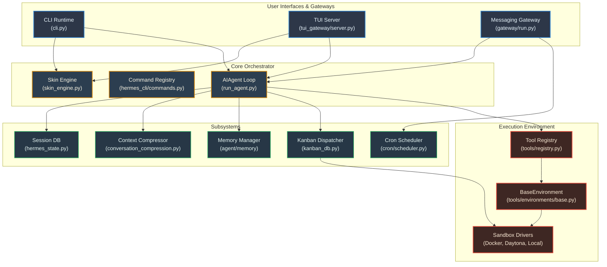

# Systems Architecture of Hermes Agent: Subsystems & Problem Solving

To build a reliable, secure, and production-ready agent, the `hermes-agent` codebase is structured as a collection of specialized subsystems. Each subsystem is dedicated to solving a specific engineering constraint—such as sandbox security, token limits, state persistence, or extensibility.

Below is a detailed breakdown of these systems, the problems they solve, and their architectural designs.

---

## System Architecture Diagram



---

## Subsystem Mapping & Problem Definitions

| Subsystem Name | Key Problem Solved | Technical Approach / Mechanism | Primary Directories / Files |
| :--- | :--- | :--- | :--- |
| **Execution Environment** | Executing untrusted shell commands safely without harming the host system. | Provider abstraction layer routing commands to Docker, SSH, Singularity, Daytona, or Local. | [tools/environments/](file:///d:/gitFolders/hermes-agent/tools/environments/) |
| **Context Compression** | Token limit exhaustion and escalating LLM API costs over long chat sessions. | Summarizes historical turns using a low-cost auxiliary model and injects a "context marker". | `agent/` (e.g., `compression/` modules) |
| **Session & State DB** | Managing multi-user/multi-platform history and finding past context quickly. | SQLite engine leveraging Full-Text Search (FTS5) for fast index retrieval and structural history tracking. | [hermes_state.py](file:///d:/gitFolders/hermes-agent/hermes_state.py) |
| **Plugin Framework** | Bloating Hermes core code with custom tools or proprietary third-party integrations. | Hook-based directory discovery with a unified `ctx.register_tool(...)` interface. | [plugins/](file:///d:/gitFolders/hermes-agent/plugins/) |
| **Memory System** | Lack of long-term recall, personalization, and user-profile awareness. | Dual-layer memory (short-term chat history vs. long-term memory providers like Honcho/Mem0). | `agent/memory/`, `plugins/memory/` |
| **Multi-Agent Kanban** | LLM failures when attempting to solve large, highly complex projects in a single thread. | Master dispatcher agent decomposes tasks into Kanban tickets; worker agents execute tasks in parallel. | [plugins/kanban/](file:///d:/gitFolders/hermes-agent/plugins/kanban/) |
| **Cron Scheduling** | Running background tasks, alerts, or automated daily actions reliably. | SQLite-backed task store, a 60s background tick loop, file-based execution locks, and delivery adapters. | [cron/](file:///d:/gitFolders/hermes-agent/cron/) |
| **Skin/Theme Engine** | UI/UX visual layout rendering is hardcoded, making styling changes rigid and complex. | Pure-data YAML configuration mapping colors, brand names, and spinner characters. | [hermes_cli/skin_engine.py](file:///d:/gitFolders/hermes-agent/hermes_cli/skin_engine.py) |
| **Observability** | Tracking errors, API usage, and performance latency across long runs. | Custom middleware and metrics exporter logging detailed spans, traces, and token costs. | `plugins/observability/` |

---

## Detailed System Deep Dives

### 1. The Execution Environment System
*   **The Problem**: Executing arbitrary code or shell commands directly on the host system risks file corruption, data loss, or system-level security compromises.
*   **The Architecture**: Hermes wraps all execution inside isolated environment drivers. Scripts interact with [BaseEnvironment](file:///d:/gitFolders/hermes-agent/tools/environments/base.py) rather than running python subprocesses directly.
*   **Function Invocation**:
    Inside [tools/environments/base.py:L787-834](file:///d:/gitFolders/hermes-agent/tools/environments/base.py#L787-L834), the `execute` method wraps the command, triggers shell execution via `_run_bash`, and polls the process state:
    ```python
    def execute(
        self,
        command: str,
        timeout: Optional[float] = None,
        interactive: bool = False,
    ) -> CommandResult:
        # Enforces working directory & wraps command for terminal backend
        wrapped = self._wrap_command(command)
        pid = self._run_bash(wrapped)
        
        # Polls process output and handles execution interrupts
        return self._wait_for_process(pid, timeout)
    ```

### 2. Context Compression Engine
*   **The Problem**: Long developer-agent interactions cause transcripts to hit token window limits and increase inference API costs.
*   **The Architecture**: A sliding window compressor monitors token counts and condenses historical turns using a low-cost auxiliary model.
*   **Function Invocation**:
    Inside [run_agent.py](file:///d:/gitFolders/hermes-agent/run_agent.py), the `AIAgent.run_conversation` loop calls `_compress_context` once the session approaches the model's threshold limit:
    ```python
    # run_agent.py - Triggers context compression
    if self.compression_enabled and self.context_compressor:
        # Check token usage against thresholds and compress history
        did_compress = self._compress_context(messages)
    ```

### 3. Session State Database
*   **The Problem**: Restoring conversation logs across platform/CLI sessions and providing high-speed search functionality.
*   **The Architecture**: An SQLite relational backend with FTS5 search tables.
*   **Function Invocation**:
    Inside [hermes_state.py](file:///d:/gitFolders/hermes-agent/hermes_state.py), search queries are compiled and run against virtual tables for sub-millisecond retrieval:
    ```python
    # hermes_state.py - SessionDB.search_messages
    def search_messages(self, query: str) -> List[Dict[str, Any]]:
        # FTS5 search query mapping terms across historical sessions
        cursor.execute(
            "SELECT session_id, message_index, content "
            "FROM messages_fts WHERE messages_fts MATCH ?",
            (query,)
        )
    ```

### 4. Memory System
*   **The Problem**: Maintaining personalization (e.g., coding style, developer rules, target libraries) across different session boundaries.
*   **The Architecture**: Custom memory providers (like Honcho or Mem0) are discovered and managed dynamically by a central adapter.
*   **Function Invocation**:
    Inside [agent/agent_init.py:L990-1036](file:///d:/gitFolders/hermes-agent/agent/agent_init.py#L990-L1036), the memory provider is loaded and initialized:
    ```python
    # agent_init.py - Initialize memory provider
    if _mem_provider_name and _mem_provider_name.strip():
        from plugins.memory import load_memory_provider as _load_mem
        agent._memory_manager = _MemoryManager()
        _mp = _load_mem(_mem_provider_name)
        if _mp and _mp.is_available():
            agent._memory_manager.add_provider(_mp)
            agent._memory_manager.initialize_all(**_init_kwargs)
    ```

### 5. Multi-Agent Kanban
*   **The Problem**: LLM performance decays when handling highly complex, multi-step projects in a single chat context.
*   **The Architecture**: The manager decomposes project tasks into a SQLite Kanban database. An embedded dispatcher claims ready tasks and spawns isolated worker subprocesses.
*   **Function Invocation**:
    Inside [gateway/run.py:L4995-5060](file:///d:/gitFolders/hermes-agent/gateway/run.py#L4995-L5060), the gateway-embedded dispatcher runs a loop calling `dispatch_once`:
    ```python
    # gateway/run.py - Embedded Kanban dispatcher loop
    async def _kanban_dispatcher(self):
        while self._running:
            # Runs ticket dispatch in a separate thread to prevent event-loop block
            await asyncio.to_thread(
                _kb.dispatch_once,
                conn,
                max_spawn=max_spawn,
                max_in_progress=max_in_progress,
            )
            await asyncio.sleep(interval)
    ```
    Inside [hermes_cli/kanban_db.py:L5214-5350](file:///d:/gitFolders/hermes-agent/hermes_cli/kanban_db.py#L5214-L5350), `_default_spawn` invokes the worker command via a detached subprocess:
    ```python
    # hermes_cli/kanban_db.py - Spawning worker subprocesses
    cmd = [
        *_resolve_hermes_argv(),
        "-p", profile_arg,
        "--accept-hooks",
    ]
    # Spawns a detached subprocess executing the assigned worker task
    subprocess.Popen(cmd, env=env, stdout=log_file, stderr=log_file)
    ```

### 6. The Scheduling Engine (Cron)
*   **The Problem**: Running scheduled cron automation (such as running daily tests or polling system updates) in the background.
*   **The Architecture**: SQLite-backed cron definitions triggered by a polling ticker.
*   **Function Invocation**:
    Inside [gateway/run.py:L17654-17681](file:///d:/gitFolders/hermes-agent/gateway/run.py#L17654-L17681), the gateway starts the ticker thread:
    ```python
    # gateway/run.py - Ticker initialization
    def _start_cron_ticker(self):
        def cron_tick():
            from cron.scheduler import tick
            # Triggers due cron jobs and re-schedules recurring jobs
            tick()
        self._cron_thread = threading.Thread(target=cron_tick, daemon=True)
        self._cron_thread.start()
    ```

### 7. Skin/Theme Engine
*   **The Problem**: Managing dynamic styling preferences (branding logos, spinners, and border colors) across CLI and TUI runtimes.
*   **The Architecture**: Configuration-driven theme maps parsed from YAML configs.
*   **Function Invocation**:
    Initialized in [cli.py:L640-644](file:///d:/gitFolders/hermes-agent/cli.py#L640-L644) (for CLI) and [tui_gateway/server.py:L758-760](file:///d:/gitFolders/hermes-agent/tui_gateway/server.py#L758-L760) (for TUI sessions):
    ```python
    # cli.py - CLI skin initialization
    try:
        from hermes_cli.skin_engine import init_skin_from_config
        init_skin_from_config(CLI_CONFIG)
    except Exception:
        pass
    ```
    ```python
    # tui_gateway/server.py - TUI skin initialization
    from hermes_cli.skin_engine import init_skin_from_config
    init_skin_from_config(_load_cfg())
    ```

---

## Why This Modular Design Matters

By decoupling these systems, Hermes achieves three critical benefits:
1.  **Fault Isolation**: If the Telegram adapter crashes due to an API timeout, the core `AIAgent` execution logic is completely unaffected.
2.  **Platform Agnosticism**: The core agent doesn't know (or care) whether it is talking to a terminal CLI, a Slack webhook, or a cron scheduler. It simply consumes `MessageEvent` objects and outputs text.
3.  **Security Boundaries**: By separating the **Execution Environment** from the **Inference Loop**, the LLM cannot directly hijack the host OS, even if it suffers a prompt-injection attack, since commands are forced through the environment driver's containerized boundaries.
