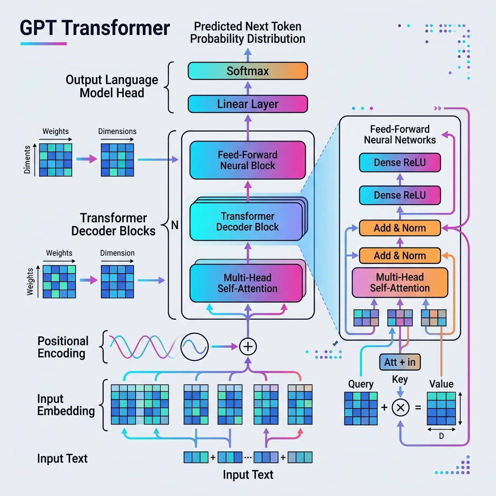

# Visual Exploration of the Scratch LLM (GPT)

We have successfully built a "maximal" GPT architecture from scratch. Below is a deep dive into the layers and the visual structure of the model.

## 1. The Model Architecture (The "Brain" Structure)

The diagram below illustrates the full hierarchy of layers we implemented in [model.py](file:///d:/gitFolders/localmodel_exercises/scratch_llm/model.py). Each block is a matrix operation that transforms raw numbers into semantic meaning.



### Key Layers Explained:
- **Token Embedding**: Maps each character to a high-dimensional vector space (n_embd = 384).
- **Transformer Blocks**: The heart of the model. We implemented 6 layers of these.
  - **Multi-Head Self-Attention**: Allows tokens to "look at" each other to understand context.
  - **Feed-Forward Network (FFN)**: A deep MLP that processes the context gathered by attention.
- **LayerNorm & Residuals**: Essential for training stability in "maximal" models.

## 2. Visualizing the "Empty Matrix"

As you noted, a model starts as an "empty matrix" (actually filled with random noise). Training is the process of carving patterns into these matrices. Below is a visualization of what these internal weight matrices look like.


### What we see here:
- **Embedding Matrix**: Shows how different tokens (characters) are initialized.
- **Attention Weights**: The complex grid patterns that represent how different parts of the sequence relate to each other.
- **Projection Matrices**: The linear layers that transform data between different dimensionalities.

## 3. Programmatic Layer Inspection

To look at the raw layers programmatically, you can use the `named_modules()` method in PyTorch. This allows you to iterate through every component and inspect its parameters (shapes, names, etc.).

We've created a helper script: **[inspect_layers.py](file:///d:/gitFolders/localmodel_exercises/scratch_llm/inspect_layers.py)**

```python
import torch
from model import GPTLanguageModel

# Initialize model
model = GPTLanguageModel(vocab_size=65) # Using default vocab size

print("--- Programmatic Layer Inspection ---")
for name, module in model.named_modules():
    if len(list(module.children())) == 0: # Only leaf modules (actual layers)
        print(f"Layer: {name}")
        for p_name, param in module.named_parameters():
            print(f"  -> Parameter: {p_name} | Shape: {list(param.shape)}")
```

## 4. Exporting Model as Text

If you want to export the entire model structure as a text file (similar to how Hugging Face displays model summaries), you can use the built-in string representation of the model.

We have updated **[export_hf.py](file:///d:/gitFolders/localmodel_exercises/scratch_llm/export_hf.py)** to also generate a `model_structure.txt` file.

```python
with open('model_structure.txt', 'w') as f:
    f.write(str(model))
```

This provides a human-readable text "map" of every matrix in your LLM.
